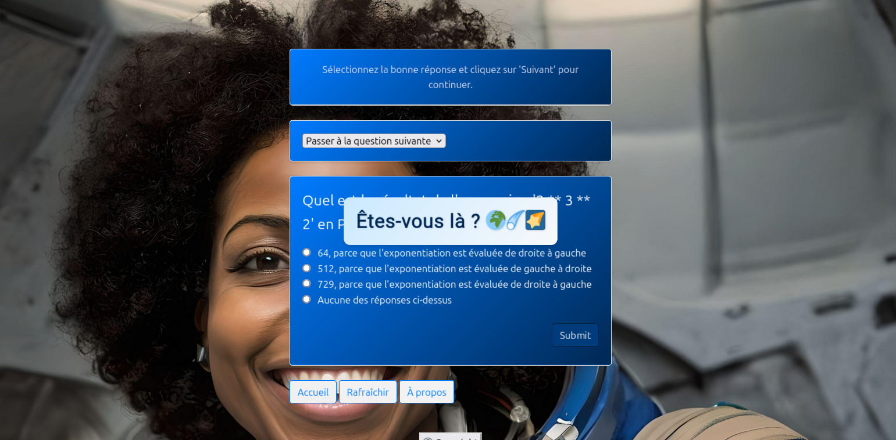
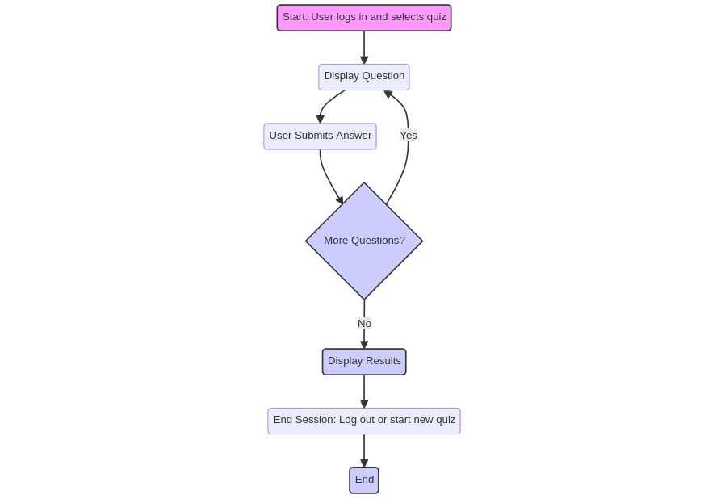

# Shiny Dollop: Fullstack Quiz Training Platform 🌟

Welcome to **Shiny Dollop**, your comprehensive quiz platform designed to enhance and refine your learning through interactive quizzes across a variety of subjects. With a user-friendly interface and a vast collection of quizzes, Shiny Dollop ensures an enriching and enjoyable learning journey.

## How the App Works 🚀

- **Upload Your CV** 📤: 
  - Navigate to our CV upload section to get feedback on your resume's strength and appeal.

- **Analysis and Results** 🔍:
  - Receive detailed analysis of your quiz responses with insights into areas for improvement.

- **Quality Star Rating** ⭐:
  - Rate each quiz session and view aggregated ratings to gauge the quality and difficulty of our quizzes.

- **Quiz Improvement Tips** 💡:
  - Get personalized tips on how to improve your quiz performances and learn more effectively.

- **Technical Support** 🛠️:
  - For any issues or inquiries, please reach out to our technical support team via email at [contact@kvnbbg.fr](mailto:contact@kvnbbg.fr).

## Configuration 🛠️

- **Programming Paradigm**: Object-Oriented
- **Languages**: Python, Flask, HTML, CSS, JavaScript
- **Project Type**: Web Development
- **Comment Style**: Descriptive
- **Code Structure**: Modular
- **Error Handling Strategy**: Robust
- **Performance Optimization**: High priority

## Getting Started 🌟

### Play the Quiz

Ready to test your skills? Click below to dive into your quiz adventure! Our quizzes are available in both English and French to accommodate a diverse audience.

## Project Management Tools 🛠️

- **Trello Board**: Monitor our project milestones and tasks via our [Trello board](https://trello.com/b/wxngDswo/kvnbbg-shiny-dollop).
- **GitHub Repository**: Access our source code and resources on [GitHub](https://github.com/Kvnbbg/shiny-dollop).
- **Live Application**: Experience the application live [here](https://shiny-dollop-quizz-da86060a8495.herokuapp.com/).

## Features 🌐

- **Wide Range of Topics**: Explore quizzes across multiple subjects and discover new interests.
- **Multilingual Support**: Enjoy quizzes in both English and French.
- **User-Friendly Interface**: Designed for ease of use, ensuring a seamless learning experience.
- **Progress Tracking**: Monitor your improvement and see how your knowledge expands over time.

## Feedback and Support 💌

Your feedback is invaluable! If you have suggestions, questions, or need assistance, please don't hesitate to reach out. We're dedicated to enhancing your experience on Shiny Dollop.

## License 📜

Shiny Dollop is distributed under the [Mozilla Public License 2.0](https://opensource.org/licenses/MPL-2.0). For more details, see the [LICENSE](LICENSE) file.

## Contributing

Interested in contributing? Great! Please refer to our contributing guidelines for detailed instructions on how you can get involved in improving Shiny Dollop.

## Additional Resources 📁

### STUDI Folder

The STUDI folder contains essential resources for exam preparation, including:

- **Study Guide**: [User Manual](STUDI/manuel_utilisateur.pdf)
- **Flowcharts & Diagrams**: 